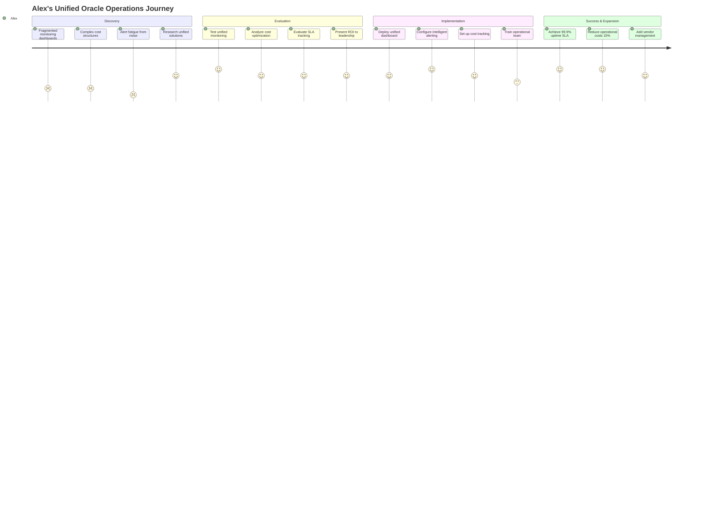
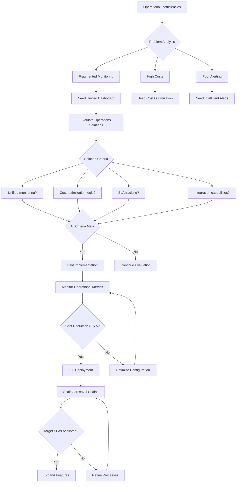
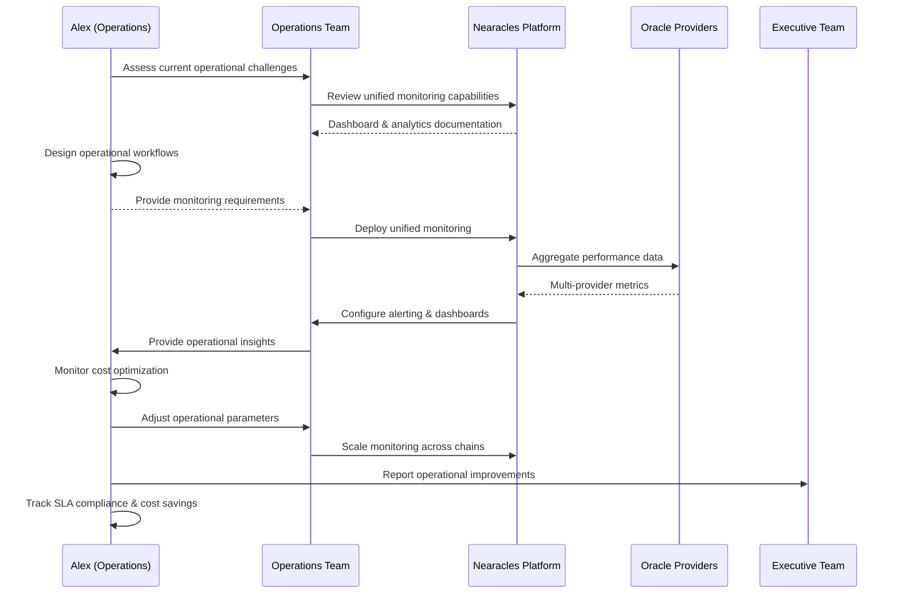

# Alex Kim - DeFi Operations Manager

## Overview
**Age:** 32  
**Location:** Seoul, South Korea  
**Role:** Head of Operations  
**Company:** Multi-chain DeFi protocol (~$120M TVL across 4 chains)  
**Experience:** 7 years operations management, 5 years crypto/DeFi  

## Demographics & Background
- Business Administration degree from Seoul National University
- Previously operations manager at Binance Korea and crypto exchange startup
- Fluent in Korean, English, and Japanese, manages APAC operations
- Lives in Gangnam district, works hybrid with distributed team
- Active in Korean DeFi communities, frequent speaker at Seoul blockchain events
- Expertise in scaling operations for high-growth DeFi protocols

## Primary Goals
- **Monitor oracle performance** across multiple chains and ensure uptime SLAs
- **Optimize operational costs** for oracle services while maintaining quality
- **Ensure data quality** meets protocol requirements for automated strategies
- **Scale operations efficiently** as protocol TVL and user base grows
- **Provide clear reporting** to leadership on oracle ROI and performance
- **Manage vendor relationships** with oracle providers and infrastructure partners

## Key Frustrations
- **Fragmented monitoring** across multiple oracle providers and chains
- **Complex cost structures** make budgeting and optimization difficult
- **Alert fatigue** from too many low-priority notifications
- **Manual reporting** processes consume significant time
- **Vendor communication** issues during critical outages
- **Limited visibility** into oracle performance impact on protocol metrics

## Personality Traits
- **Process-oriented** - creates systematic approaches to operational challenges
- **Cost-conscious** - always looking for efficiency improvements and savings
- **Detail-focused** - catches operational issues before they become problems
- **Team coordinator** - bridges technical and business stakeholders effectively
- **Proactive communicator** - provides regular updates and transparent reporting
- **Technology pragmatist** - adopts tools that solve real operational problems

## Needs & Expectations
- **Unified monitoring dashboard** - single view across all oracle providers
- **Cost optimization tools** - clear breakdown of oracle expenses and usage
- **Automated alerting** - intelligent notifications for business-critical issues
- **Performance analytics** - historical trends and impact analysis
- **SLA monitoring** - track vendor performance against contractual commitments
- **Integration capabilities** - connect with existing operational tools and workflows

## Key Behaviors & Actions
- **Monitors daily operations** through dashboards and automated reports
- **Conducts weekly vendor reviews** with oracle providers and infrastructure teams
- **Creates operational reports** for leadership and stakeholder updates
- **Manages incident response** when oracle failures affect protocol operations
- **Optimizes resource allocation** across different oracle services and chains
- **Plans capacity scaling** based on protocol growth and usage projections

## Technology Stack
- **Monitoring:** Datadog, Grafana, custom dashboards, PagerDuty
- **Communication:** Slack, Discord, email, video conferencing
- **Analytics:** Excel, Google Sheets, basic SQL for data analysis
- **Project Management:** Notion, Linear, Asana for operational planning
- **Documentation:** Confluence, Google Docs for process documentation

## How He Uses Nearacles

### Daily Operations
- Checks unified Dashboard for oracle performance across all chains
- Reviews overnight alerts and incident reports
- Monitors cost usage against monthly budgets and forecasts
- Coordinates with technical teams on any performance issues

### Weekly Reporting
- Generates operational reports showing oracle uptime, costs, and performance
- Analyzes usage trends and identifies optimization opportunities
- Reviews SLA compliance and vendor performance metrics
- Provides recommendations for operational improvements

### Strategic Planning
- Uses Analytics to forecast oracle costs for budget planning
- Evaluates new oracle providers and service offerings
- Plans infrastructure scaling for protocol growth
- Manages vendor relationships and contract negotiations

### Incident Management
- Coordinates response to oracle outages or performance degradation
- Communicates with stakeholders during service disruptions
- Documents incidents and implements process improvements
- Works with vendors to resolve issues and prevent recurrence

## Representative Quote
> "I need clear visibility into oracle performance and costs across our entire multi-chain protocol. When something goes wrong, I need to know immediately and have the tools to fix it fast."

## Pain Points with Current Solutions
- **Multiple dashboards:** No unified view across oracle providers
- **Complex billing:** Difficult to track and optimize costs
- **Limited analytics:** Hard to correlate oracle performance with protocol metrics
- **Poor alerting:** Too much noise, not enough signal

## Success Metrics
- **Oracle uptime:** 99.9%+ across all chains and providers
- **Cost optimization:** 15%+ annual savings through efficiency improvements
- **Incident response:** <5 minute detection, <30 minute resolution
- **Stakeholder satisfaction:** Positive feedback on reporting and communication
- **Operational efficiency:** 50% reduction in manual reporting time

## Operational Responsibilities

### Monitoring & Alerting
- **24/7 monitoring** of oracle performance across all chains
- **Intelligent alerting** for business-critical issues only
- **Escalation procedures** for different types of incidents
- **Performance trending** to identify degradation before failures

### Vendor Management
- **SLA monitoring** and enforcement with oracle providers
- **Relationship management** with key vendor contacts
- **Contract negotiation** for cost optimization and service improvements
- **Performance reviews** and vendor scorecards

### Cost Management
- **Budget planning** and forecasting for oracle services
- **Usage optimization** to minimize costs while maintaining quality
- **Spend analysis** and identification of cost-saving opportunities
- **Financial reporting** on oracle ROI and operational efficiency

## Stakeholder Communication
- **Reports to:** Protocol CTO and CFO
- **Collaborates with:** Engineering, Product, Finance, Legal
- **Updates:** Executive team, board of directors, community
- **Manages:** Vendor relationships, service provider contracts

## Decision-Making Process
1. **Performance analysis** (oracle metrics, SLA compliance)
2. **Cost-benefit evaluation** (operational efficiency vs investment)
3. **Risk assessment** (impact on protocol operations and users)
4. **Stakeholder consultation** (technical and business requirements)
5. **Implementation planning** (rollout strategy, success metrics)
6. **Monitoring and optimization** (continuous improvement process)

## Customer Examples
- **Multi-chain protocols:** Operating across Ethereum, NEAR, Polygon, BSC
- **Yearn Finance:** Complex operations across multiple vaults and strategies
- **Synthetix:** Global operations with diverse oracle requirements
- **Chainlink ecosystem:** Protocols heavily dependent on oracle infrastructure

## User Journey Maps

### Main Customer Journey

### Decision Flow Diagram

### Technical Integration Workflow

---

*This persona represents ~25% of Nearacles' user base and is critical for customer retention and expansion. Alex-type users are key influencers who can drive increased usage or churn based on operational experience and cost optimization results.*