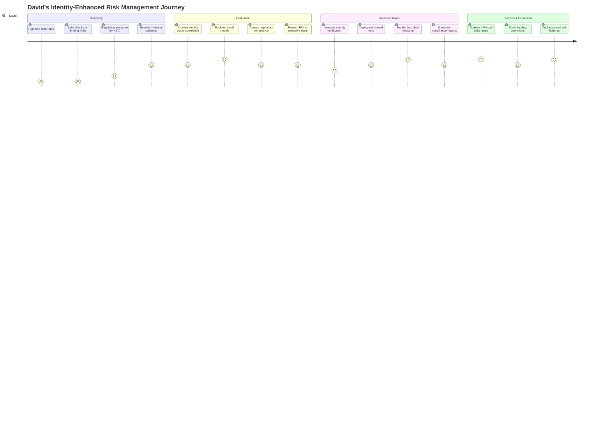
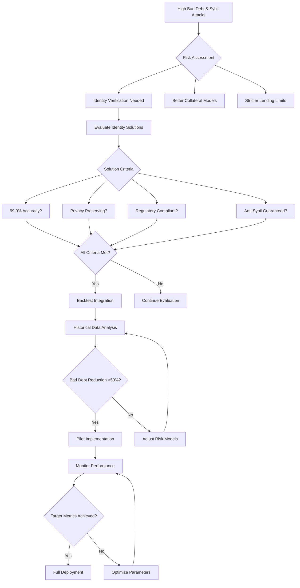
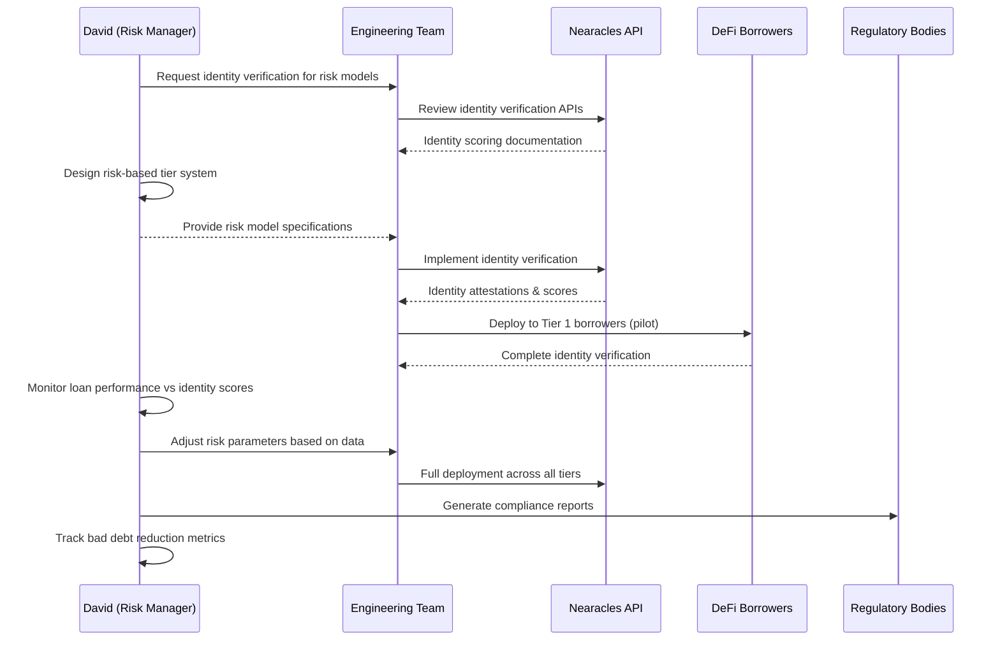

# David Chen - DeFi Risk Manager

## Overview
**Age:** 36  
**Location:** Singapore  
**Role:** Head of Risk Management  
**Company:** Leading DeFi lending protocol (~$150M TVL, 80k+ active borrowers)  
**Experience:** 12 years risk management, former Aave and traditional banking  

## Demographics & Background
- Masters in Financial Engineering from NUS, CFA and FRM certifications
- Previously Head of Credit Risk at Aave, before that VP at JPMorgan
- Speaks English, Mandarin, and Cantonese, covers APAC risk operations
- Lives in Singapore's financial district, travels frequently across Asia
- Active in DeFi risk management working groups and regulatory discussions
- Expert in both traditional finance and DeFi risk modeling

## Primary Goals
- **Improve credit risk models** using identity verification and on-chain behavior
- **Reduce bad debt and liquidation losses** through better borrower assessment  
- **Implement anti-Sybil protection** for lending limits and incentive programs
- **Ensure regulatory compliance** for identity verification requirements
- **Optimize collateral requirements** based on borrower identity and history
- **Scale lending operations** while maintaining conservative risk profiles

## Key Frustrations
- **Sybil attacks** circumventing borrowing limits and risk controls
- **Anonymous borrowers** make traditional credit models ineffective
- **Liquidation cascades** during market volatility due to poor risk assessment
- **Regulatory pressure** for Know Your Customer without clear guidelines
- **Limited data sources** for assessing borrower creditworthiness
- **Technical complexity** of integrating identity verification with lending protocols

## Personality Traits
- **Risk-averse and analytical** - prioritizes safety over growth
- **Data-driven decision maker** - relies on statistical models and backtesting
- **Compliance-conscious** - navigates regulatory requirements carefully
- **Technical translator** - bridges risk concepts with engineering teams
- **Conservative innovator** - adopts new tech cautiously after thorough testing
- **Detail-oriented perfectionist** - small errors can mean millions in losses

## Needs & Expectations
- **Reliable identity verification** - 99.9%+ accuracy for credit decisions
- **Privacy-preserving compliance** - KYC without exposing user data on-chain
- **Real-time risk scoring** - instant identity-based creditworthiness assessment
- **Anti-Sybil guarantees** - provably unique users for lending limits
- **Audit trail compliance** - complete records for regulatory examination
- **Integration flexibility** - works with existing risk management infrastructure

## Key Behaviors & Actions
- **Develops risk models** incorporating identity signals and on-chain behavior
- **Monitors lending metrics** daily for early warning signs
- **Conducts stress testing** of identity verification and credit models
- **Reviews regulatory guidance** and implements compliance procedures
- **Collaborates with engineering** on smart contract risk parameters
- **Reports to executives** on protocol health and risk exposure

## Technology Stack
- **Risk Tools:** Python/R for modeling, Jupyter notebooks, Monte Carlo simulations
- **Monitoring:** Custom dashboards, Grafana, PagerDuty for alerts
- **Data Sources:** On-chain data, identity oracles, traditional credit bureaus
- **Communication:** Slack, email, risk management forums
- **Compliance:** Document management systems, audit preparation tools

## How He Uses Nearacles

### Risk Model Development
- Integrates identity verification data into credit scoring algorithms
- Backtests lending decisions using historical identity and performance data
- Develops borrower segmentation based on identity verification levels
- Creates risk-based pricing models for different identity verification tiers

### Daily Operations
- Monitors identity verification success rates and failure patterns
- Reviews large loan applications requiring enhanced identity verification
- Tracks correlation between identity signals and loan performance
- Analyzes Sybil attack attempts and prevention effectiveness

### Compliance Management
- Documents identity verification procedures for regulatory audits
- Maintains borrower identity records for compliance requirements
- Reports identity verification statistics to regulatory bodies
- Ensures privacy compliance while meeting KYC obligations

### Strategic Analysis
- Uses Analytics to optimize identity verification requirements by risk tier
- Evaluates ROI of identity verification on bad debt reduction
- Benchmarks identity verification performance against industry standards
- Provides recommendations on identity verification policy changes

## Representative Quote
> "Identity verification is critical for our lending risk models and DAO governance. We need to know our borrowers are real people without compromising their privacy - it's the key to scaling DeFi lending responsibly."

## Pain Points with Current Solutions
- **Traditional KYC:** Too invasive and slow for DeFi users
- **No verification:** High Sybil attack risk and regulatory exposure
- **Manual processes:** Don't scale with protocol growth
- **Privacy concerns:** Users resist full identity disclosure

## Success Metrics
- **Bad debt ratio:** <2% of total loans outstanding
- **Sybil attack prevention:** 99%+ detection rate for multi-account abuse
- **Identity verification completion:** 85%+ of borrowers successfully verified
- **Regulatory compliance:** Zero violations in identity verification procedures
- **Risk-adjusted returns:** 15%+ annual yield after accounting for defaults

## Risk Management Framework

### Identity-Based Risk Tiers
- **Tier 1:** Fully verified - highest borrowing limits, lowest rates
- **Tier 2:** Partial verification - medium limits and rates
- **Tier 3:** Anonymous - lowest limits, highest rates

### Credit Scoring Integration
- **On-chain behavior:** Transaction history, DeFi protocol usage
- **Identity signals:** Verification level, social attestations
- **Market factors:** Collateral volatility, liquidity conditions
- **Temporal factors:** Account age, borrowing history

## Regulatory Considerations
- **APAC compliance:** MAS guidelines, China restrictions, Japan regulations
- **Privacy laws:** GDPR compliance, data minimization principles
- **Financial regulations:** Anti-money laundering, sanctions screening
- **Cross-border rules:** Data localization, reporting requirements

## Decision-Making Process
1. **Risk assessment** (identity verification impact on credit models)
2. **Regulatory review** (compliance with local and international laws)
3. **Technical evaluation** (integration complexity, system reliability)
4. **Backtesting validation** (historical performance analysis)
5. **Pilot program** (limited rollout with monitoring)
6. **Full deployment** (gradual scaling with risk monitoring)

## Customer Examples
- **Burrow:** NEAR-native lending with identity-enhanced credit models
- **Aave:** Leading DeFi lender implementing identity verification
- **Compound:** Established lending protocol exploring identity integration
- **Euler:** Advanced lending protocol with sophisticated risk management

## User Journey Maps

### Main Customer Journey

### Decision Flow Diagram

### Technical Integration Workflow

---

*This persona represents ~25% of Nearacles' target customers - DeFi lending protocols that need identity verification for credit risk management and regulatory compliance. David-type users are critical for high-value, long-term contracts.*