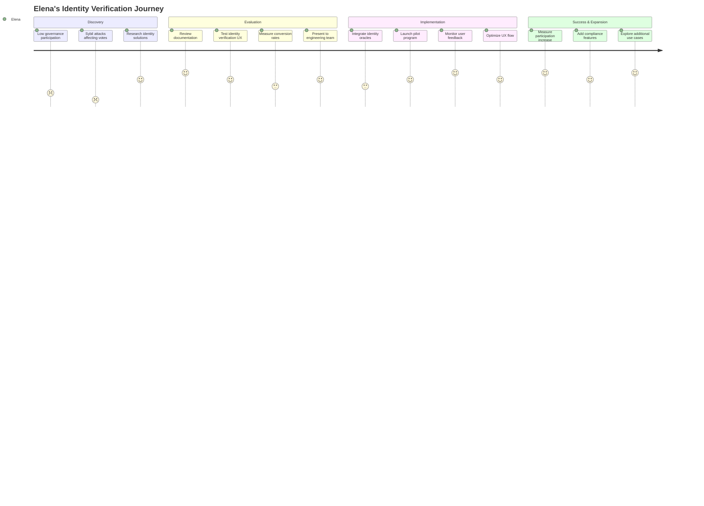
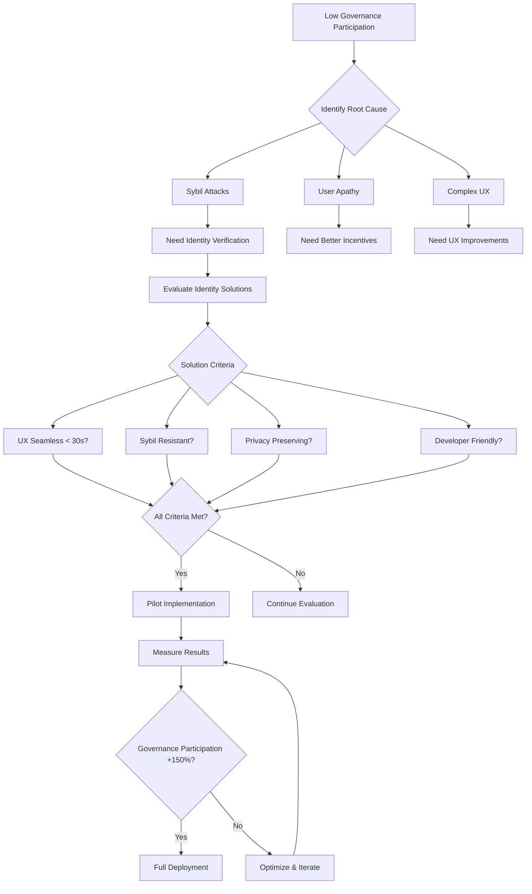
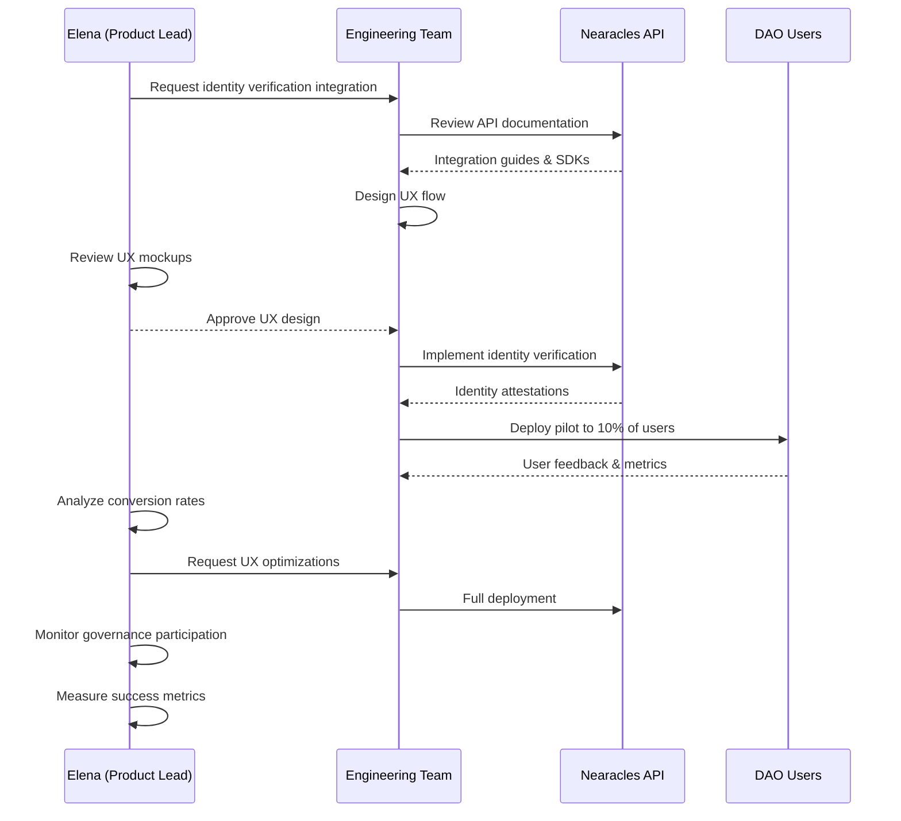

# Elena Vasquez - DeFi Product Lead

## Overview
**Age:** 31  
**Location:** Miami, FL  
**Role:** Head of Product  
**Company:** Leading AMM DEX protocol (~$200M TVL, 100k+ weekly users)  
**Experience:** 6 years DeFi product management, former Uniswap Labs PM  

## Demographics & Background
- MBA from Stanford, Economics degree from UC Berkeley
- Previously led product at Uniswap Labs and 1inch
- Fluent in Spanish and English, active in Latin American DeFi communities
- Lives in Miami's crypto hub, works with distributed global team
- Well-connected in DeFi ecosystem, frequent conference speaker
- Owns significant stake in her protocol's governance token

## Primary Goals
- **Enhance governance participation** through Sybil-resistant voting systems
- **Improve user onboarding** with KYC-lite identity verification
- **Drive protocol adoption** by reducing friction and increasing trust
- **Launch innovative features** that differentiate from competitors
- **Increase TVL and trading volume** through better user experience
- **Build sustainable tokenomics** around governance and utility

## Key Frustrations
- **Low governance participation** due to Sybil attacks and apathy
- **User acquisition costs** are high due to trust and onboarding friction
- **Regulatory uncertainty** around identity and compliance requirements
- **Feature differentiation** is difficult in crowded DEX market
- **Technical implementation** delays for complex oracle integrations
- **User education** required for new governance and identity features

## Personality Traits
- **User-experience focused** - obsesses over friction points
- **Data-driven decision maker** - relies on metrics and user feedback
- **Innovation-minded** - constantly looking for competitive advantages
- **Community-oriented** - believes in decentralized governance
- **Pragmatically idealistic** - balances decentralization with usability
- **Relationship builder** - maintains strong network across DeFi

## Needs & Expectations
- **Seamless user experience** - identity verification in under 30 seconds
- **Sybil-resistant governance** - prevent fake votes and whale manipulation
- **Privacy-preserving identity** - compliance without full KYC surveillance
- **Developer-friendly APIs** - easy integration with existing smart contracts
- **Scalable infrastructure** - handle 100k+ users without performance issues
- **Regulatory compliance** - meet requirements without breaking decentralization

## Key Behaviors & Actions
- **Analyzes user journey data** to identify drop-off points
- **Conducts user research** through surveys and community feedback
- **Collaborates with engineering** on feature specifications
- **Monitors competitor features** and market trends
- **Presents to DAO governance** on product roadmap and metrics
- **Engages with regulatory experts** on compliance strategies

## Technology Usage
- **Product Tools:** Mixpanel, Amplitude, Figma, Notion
- **DeFi Platforms:** Uses own protocol daily, tests competitors
- **Communication:** Discord, Telegram, Twitter, governance forums
- **Analytics:** Dune Analytics, DefiLlama, protocol-specific dashboards
- **Collaboration:** Linear, GitHub for technical discussions

## How She Uses Nearacles

### Discovery Phase
- Learns about identity verification oracles through DeFi Twitter and conferences
- Evaluates documentation for developer-friendly integration
- Tests identity verification flow with small user group
- Analyzes impact on user conversion and engagement metrics

### Integration Planning
- Works with engineering team to design identity verification UX
- Creates product specifications for Sybil-resistant governance
- Plans rollout strategy with gradual feature activation
- Designs user education materials and onboarding flows

### Production Usage
- Monitors identity verification conversion rates and user feedback
- Tracks governance participation improvements through Dashboard
- Uses Analytics to optimize identity verification UX
- Engages with Nearacles product team for feature requests

### Success Measurement
- Measures governance participation increase (target: +150%)
- Tracks user onboarding conversion improvements (target: +40%)
- Monitors Sybil attack reduction in voting (target: 95% reduction)
- Analyzes user sentiment and community trust metrics

## Representative Quote
> "We need seamless identity verification that doesn't break our user experience. If users can prove their identity in 30 seconds without feeling surveilled, we can solve governance participation and build real community trust."

## Pain Points with Current Solutions
- **Manual verification:** Too slow and breaks user flow
- **Full KYC providers:** Too invasive for DeFi users
- **On-chain identity:** Limited adoption and trust
- **Custom solutions:** Too expensive and time-intensive to build

## Success Metrics
- **Governance participation rate:** 25%+ of token holders voting
- **Identity verification conversion:** 80%+ completion rate
- **User trust scores:** Net Promoter Score above 50
- **Sybil attack prevention:** 95%+ reduction in fake votes
- **Feature adoption:** 60%+ of active users using identity features

## Decision-Making Process
1. **User research** (surveys, interviews, usage data)
2. **Competitive analysis** (feature comparison, market gaps)
3. **Technical feasibility** (engineering capacity, integration complexity)
4. **Business impact modeling** (TVL growth, user acquisition)
5. **Regulatory risk assessment** (compliance requirements)
6. **DAO governance proposal** (community vote on major features)

## Stakeholder Management
- **Reports to:** Protocol CEO/Founder
- **Collaborates with:** Engineering, Marketing, Community, Legal
- **Presents to:** DAO governance, investor updates, community calls
- **Influences:** Product roadmap, user experience, governance features

## Customer Examples
- **Ref Finance:** Leading NEAR AMM with governance token and DAO
- **Uniswap:** Original inspiration, governance participation challenges
- **SushiSwap:** Community-driven governance and product decisions
- **Curve Finance:** Vote-escrowed tokenomics and governance voting

## User Journey Maps

### Main Customer Journey

### Decision Flow Diagram

### Technical Integration Workflow

---

*This persona represents ~30% of Nearacles' target customers - established DeFi protocols focused on governance, user experience, and community building. Elena-type users are key decision makers for identity verification and governance oracle integrations.*