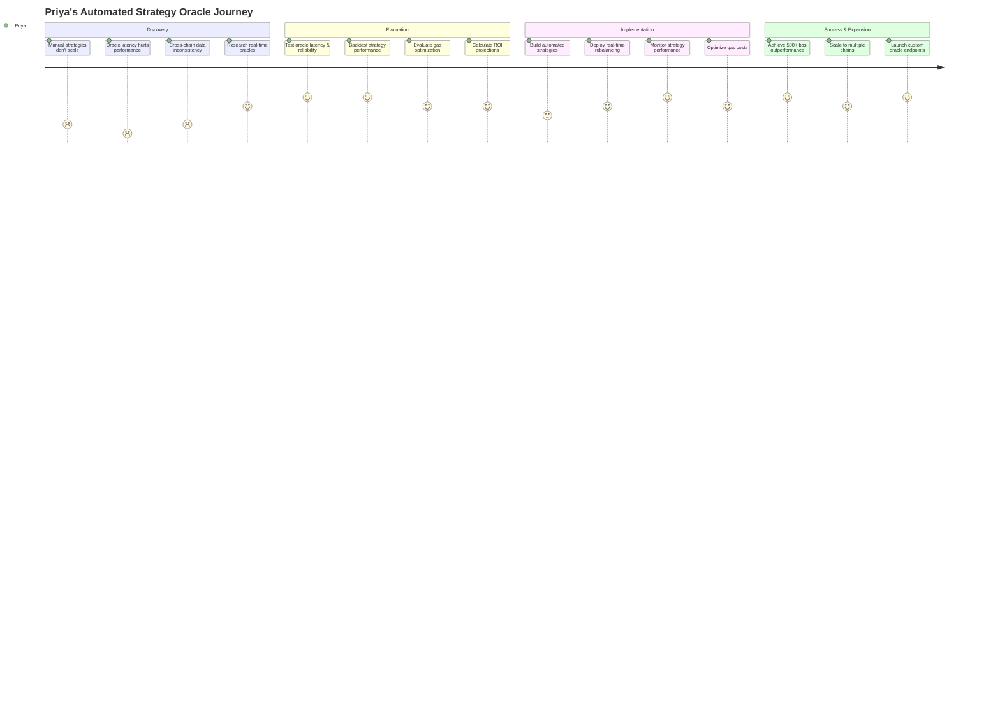
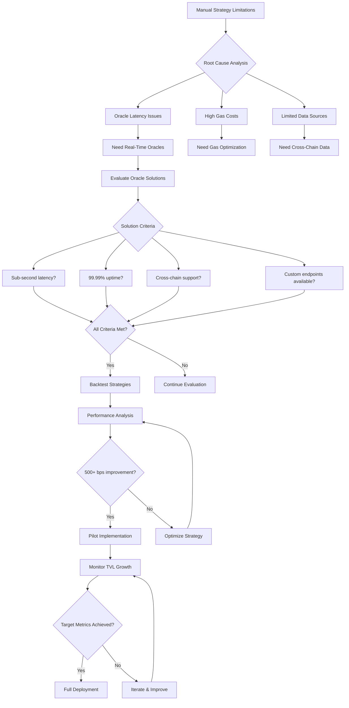
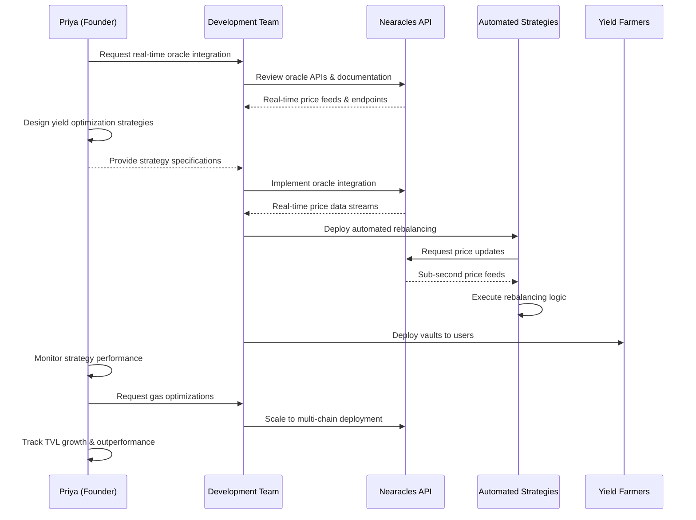

# Priya Sharma - DeFi Protocol Founder

## Overview
**Age:** 29  
**Location:** Bangalore, India  
**Role:** Founder & CEO  
**Company:** Yield optimization protocol (~$80M TVL, automated vault strategies)  
**Experience:** 8 years fintech, 4 years DeFi, former Goldman Sachs quant  

## Demographics & Background
- Masters in Computer Science from IIT Bombay, MBA from Wharton
- Previously quantitative analyst at Goldman Sachs, then fintech startup CTO
- Fluent in English, Hindi, and Kannada, leads distributed global team
- Based in Bangalore's tech hub, frequent traveler to crypto conferences
- Angel investor in DeFi startups, advisor to multiple yield farming protocols
- Strong technical background with deep understanding of automated strategies

## Primary Goals
- **Build automated yield strategies** that outperform manual farming
- **Scale protocol TVL** through superior risk-adjusted returns
- **Implement dynamic rebalancing** based on real-time market conditions
- **Expand to multiple chains** with unified oracle infrastructure
- **Create sustainable tokenomics** around automated strategy performance
- **Establish market leadership** in automated DeFi yield optimization

## Key Frustrations
- **Manual strategy management** doesn't scale with TVL growth
- **Oracle latency and reliability** affects strategy performance
- **Cross-chain data inconsistency** complicates multi-chain strategies  
- **Gas optimization** is critical for automated rebalancing profitability
- **Regulatory uncertainty** around automated financial strategies
- **User education** required for complex yield strategy concepts

## Personality Traits
- **Visionary strategist** - thinks about long-term protocol evolution
- **Technical perfectionist** - demands high-performance automated systems
- **Data-obsessed** - makes decisions based on quantitative analysis
- **User-focused** - prioritizes simplicity despite technical complexity
- **Ambitious leader** - wants to build the definitive yield optimization platform
- **Relationship builder** - maintains strong network across DeFi ecosystem

## Needs & Expectations
- **Real-time price feeds** - sub-second latency for automated strategies
- **Cross-chain data consistency** - unified oracle infrastructure across chains
- **Historical data access** - backtesting and strategy optimization
- **Custom oracle endpoints** - specialized data feeds for unique strategies
- **High reliability SLAs** - automated strategies can't afford downtime
- **Gas-optimized integrations** - minimize transaction costs for rebalancing

## Key Behaviors & Actions
- **Develops quantitative models** for yield optimization and risk management
- **Monitors protocol performance** through comprehensive analytics dashboards
- **Collaborates with DeFi protocols** on partnership and integration opportunities
- **Presents at conferences** on automated yield strategies and DeFi innovation
- **Raises capital** from VCs and crypto funds for protocol development
- **Builds strategic partnerships** with oracles, DEXes, and lending protocols

## Technology Stack
- **Development:** Rust, Solidity, Python for quantitative modeling
- **Infrastructure:** AWS, monitoring with custom dashboards
- **Analytics:** Python/R for backtesting, Jupyter for strategy development
- **Communication:** Discord, Telegram, Twitter for community building
- **Business:** Notion for planning, Figma for strategy visualization

## How She Uses Nearacles

### Strategy Development
- Uses real-time oracle data for automated vault rebalancing decisions
- Backtests yield strategies using historical oracle price feeds
- Implements cross-chain arbitrage strategies using unified oracle infrastructure
- Develops risk management algorithms based on oracle data quality metrics

### Operations Management
- Monitors oracle performance and latency through executive dashboards
- Sets up alerts for oracle failures that could affect automated strategies
- Optimizes oracle usage to minimize gas costs while maintaining performance
- Tracks oracle ROI impact on overall protocol yield performance

### Strategic Planning
- Uses Analytics to identify new market opportunities and yield sources
- Evaluates oracle coverage for expansion to new assets and chains
- Plans oracle infrastructure scaling for TVL growth projections
- Negotiates enterprise oracle contracts for predictable costs

### Partnership Development
- Collaborates with oracle providers on custom data feed requirements
- Integrates with multiple oracle sources for redundancy and data validation
- Partners with other DeFi protocols requiring similar oracle infrastructure
- Advises other founders on oracle integration best practices

## Representative Quote
> "We need oracles that can feed real-time data to our automated vault strategies. When yield opportunities exist for just minutes, oracle latency is the difference between profit and loss for our users."

## Pain Points with Current Solutions
- **Chainlink:** Reliable but expensive for high-frequency strategies
- **Band Protocol:** Good coverage but limited cross-chain consistency
- **Custom oracles:** Too much infrastructure overhead to maintain
- **Free alternatives:** Unreliable for automated strategies requiring precision

## Success Metrics
- **Protocol TVL growth:** 50%+ quarter-over-quarter growth
- **Strategy outperformance:** 500+ basis points above benchmark yields
- **Oracle uptime:** 99.99%+ availability for automated strategies
- **Cross-chain expansion:** Successfully operating on 5+ blockchain networks
- **User satisfaction:** Net Promoter Score above 60 from yield farmers

## Business Model & Strategy

### Revenue Streams
- **Performance fees:** 20% of yield generated above benchmark
- **Management fees:** 2% annual fee on assets under management
- **Token incentives:** Protocol token rewards for early adopters
- **Partnership revenue:** Revenue sharing with integrated protocols

### Competitive Advantages
- **Automated strategies:** Superior risk-adjusted returns vs manual farming
- **Cross-chain optimization:** Unified yield opportunities across chains
- **Institutional-grade infrastructure:** Reliable enough for large capital
- **Quantitative expertise:** Data-driven strategy development and optimization

## Technical Architecture

### Automated Strategy Engine
- **Real-time rebalancing:** Oracle-driven position adjustments
- **Risk management:** Dynamic position sizing based on market conditions
- **Gas optimization:** Intelligent batching and transaction timing
- **Cross-chain coordination:** Unified strategy execution across networks

### Oracle Integration Requirements
- **Sub-second latency:** Critical for automated arbitrage strategies
- **High availability:** 99.99%+ uptime with redundant data sources
- **Custom endpoints:** Specialized data feeds for unique strategies
- **Historical data:** Backtesting and strategy optimization capabilities

## Decision-Making Process
1. **Quantitative analysis** (strategy backtesting, risk modeling)
2. **Technical evaluation** (oracle reliability, integration complexity)
3. **Cost-benefit analysis** (oracle costs vs strategy profitability)
4. **Partnership assessment** (strategic value, ecosystem alignment)
5. **Implementation planning** (development timeline, resource allocation)
6. **Performance monitoring** (strategy optimization, oracle evaluation)

## Customer Examples
- **PembRock Finance:** Leveraged yield farming with automated rebalancing
- **Meta Pool:** Liquid staking with automated strategy optimization
- **Yearn Finance:** Pioneer in automated yield optimization strategies
- **Convex Finance:** Automated Curve yield optimization and management

## User Journey Maps

### Main Customer Journey

### Decision Flow Diagram

### Technical Integration Workflow

---

*This persona represents ~20% of Nearacles' target customers - automated yield protocols that need real-time, reliable oracle data for strategy execution. Priya-type users are high-value customers requiring sophisticated oracle infrastructure and custom solutions.*